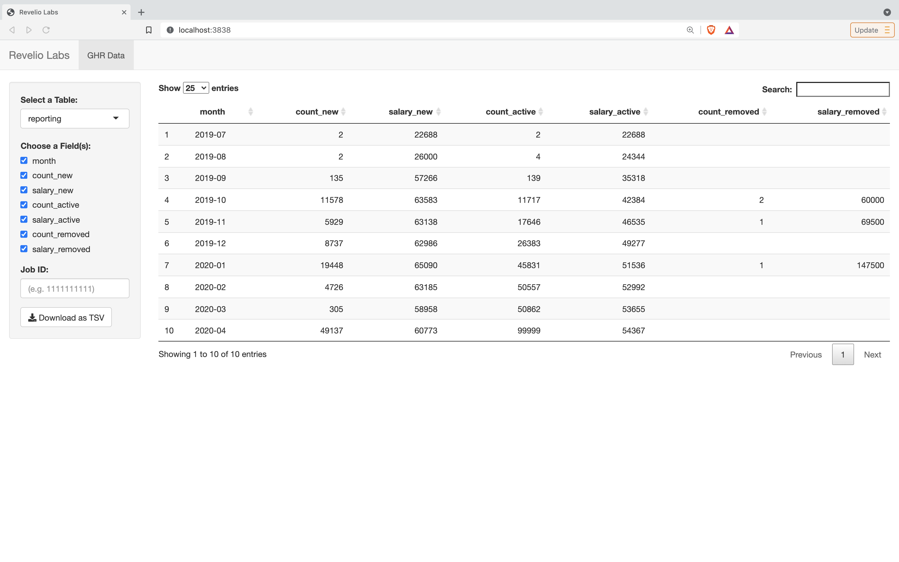

# Revelio Labs Data Engineer Assignment

## Quickstart

### Running from Command Line Interface (CLI)

1. Make sure Git is pre-installed and clone this repository.

```
$ git clone git@github.com:liberaliscomputing/revelio-labs-assignment.git
$ cd revelio-labs-assignment
```

2. Make sure a Postgres DB running either remotely or locally and a psql client is pre-installed.

3. (Optional) On the current directory, create `.env` with the following environment variables polulated:

```
# Postgres credentials
POSTGRES_PASSWORD=<your-password>
POSTGRES_DB=<your-db>
POSTGRES_HOST=<your-host>
POSTGRES_PORT=<your-port>
POSTGRES_USER=<your-user>
```

Unless provided, the following credentials are assumed:

```
# Postgres credentials
POSTGRES_PASSWORD=password
POSTGRES_DB=postgres
POSTGRES_HOST=localhost
POSTGRES_PORT=5432
POSTGRES_USER=postgres
```

4. The following command runs Tasks 1 through 4.

```
$ ./scripts/entrypoint.sh
```

5. (Optional) Make sure R is pre-installed and run the following command.

```
$ ./scripts/run_app.sh
```

6. (Optional) A R Shiny web application rendering the created tables is available at http://localhost:3838.



### Running from a Docker Network

If you think following the above steps are hassles, you can simpy run it in a Docker network because we are living in a world of containers 🐳🐳

1. Make sure Git is pre-installed and clone this repository.

```
$ git clone git@github.com:liberaliscomputing/revelio-labs-assignment.git
$ cd revelio-labs-assignment
```

2. Make sure Docker and Docker Compose are pre-installed.

3. If you haven't done already, create a `revelio-labs-assignment` network.

```
$ docker network create revelio-labs-assignment
```

4. Bring up the Docker Compose stack.

```
$ docker-compose up -d --build
```

5. If run successfully, a R Shiny web application rendering the created tables is available at http://localhost:3838.


6. Bring down the Docker Compose stack when stopping all services.

```
$ docker-compose down --remove-orphans -v [ --rmi all ]
```
